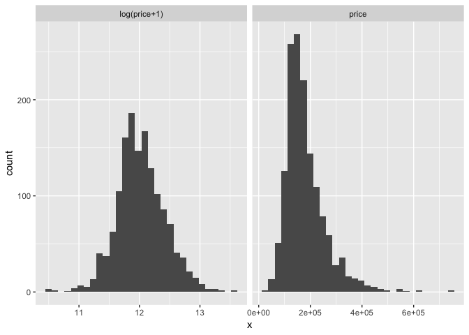
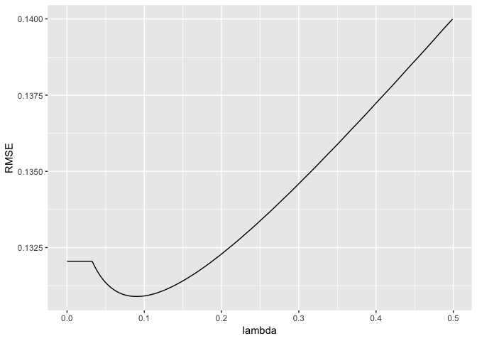
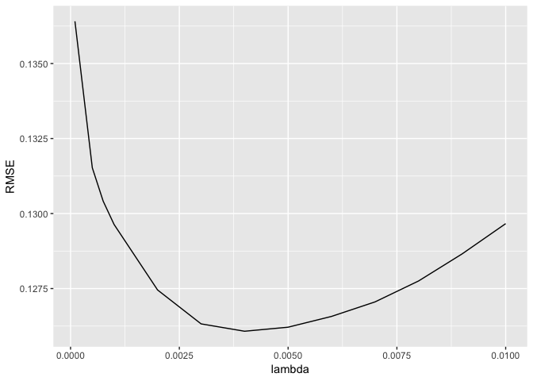
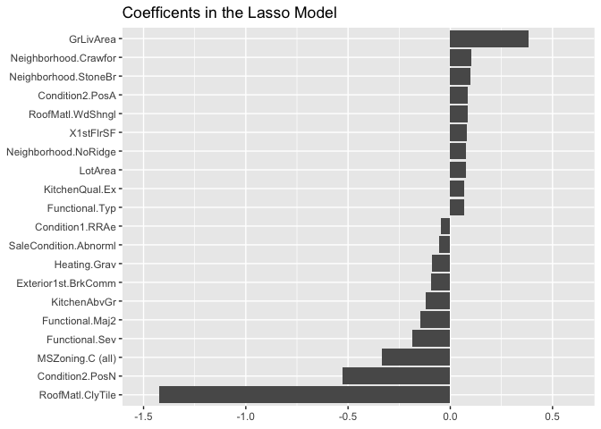

```r
# get the require R packages
library(ggplot2)
library(plyr)
library(dplyr)
```

```
## 
## Attaching package: 'dplyr'
```

```
## The following objects are masked from 'package:plyr':
## 
##     arrange, count, desc, failwith, id, mutate, rename, summarise,
##     summarize
```

```
## The following objects are masked from 'package:stats':
## 
##     filter, lag
```

```
## The following objects are masked from 'package:base':
## 
##     intersect, setdiff, setequal, union
```

```r
library(caret)
```

```
## Loading required package: lattice
```

```r
library(glmnet)
```

```
## Loading required package: Matrix
```

```
## Loading required package: foreach
```

```
## Loaded glmnet 2.0-16
```

```r
library(knitr)
library(moments)
```


```r
train = read.csv("kaggle_house_pred_train.csv")
test = read.csv("kaggle_house_pred_test.csv")

# combine train and test data for preprocessing
all_data <- rbind(select(train,MSSubClass:SaleCondition),
                  select(test,MSSubClass:SaleCondition))

# get data frame of SalePrice and log(SalePrice + 1) for plotting
df <- rbind(data.frame(version="log(price+1)",x=log(train$SalePrice + 1)),
            data.frame(version="price",x=train$SalePrice))

# plot histogram
ggplot(data=df) +
  facet_wrap(~version,ncol=2,scales="free_x") +
  geom_histogram(aes(x=x), bins=30)
```

<!-- -->

```r
# transform SalePrice target to log form
train$SalePrice <- log(train$SalePrice + 1)

# for numeric feature with excessive skewness, perform log transformation
# first get data type for each feature
feature_classes <- sapply(names(all_data),function(x){class(all_data[[x]])})
numeric_feats <-names(feature_classes[feature_classes == "integer"])

# determine skew for each numeric feature
skewed_feats <- sapply(numeric_feats, FUN =  function(x){skewness(all_data[[x]],na.rm=TRUE)})

# keep only features that exceed a threshold for skewness
skewed_feats <- skewed_feats[skewed_feats > 0.75]

# transform excessively skewed features with log(x + 1)
for(x in names(skewed_feats)) {
  all_data[[x]] <- log(all_data[[x]] + 1)
}

# get names of categorical features
categorical_feats <- names(feature_classes[feature_classes == "factor"])

# use caret dummyVars function for hot one encoding for categorical features
dummies <- dummyVars(~.,all_data[categorical_feats])
categorical_1_hot <- predict(dummies,all_data[categorical_feats])
categorical_1_hot[is.na(categorical_1_hot)] <- 0  #for any level that was NA, set to zero


# for any missing values in numeric features, impute mean of that feature
numeric_df <- all_data[numeric_feats]

for (x in numeric_feats) {
  mean_value <- mean(train[[x]],na.rm = TRUE)
  all_data[[x]][is.na(all_data[[x]])] <- mean_value
}


# reconstruct all_data with pre-processed data
all_data <- cbind(all_data[numeric_feats],categorical_1_hot)

# create data for training and test
X_train <- all_data[1:nrow(train),]
X_test <- all_data[(nrow(train)+1):nrow(all_data),]
y <- train$SalePrice
```


```r
# set up caret model training parameters
# model specific training parameter
CARET.TRAIN.CTRL <- trainControl(method="repeatedcv",
                                 number=5,
                                 repeats=5,
                                 verboseIter=FALSE)


# test out Ridge regression model

lambdas <- seq(1,0,-0.001)

# train model
set.seed(123)  # for reproducibility
model_ridge <- train(x=X_train,y=y,
                     method="glmnet",
                     metric="RMSE",
                     maximize=FALSE,
                     trControl=CARET.TRAIN.CTRL,
                     tuneGrid=expand.grid(alpha=0, # Ridge regression
                                          lambda=lambdas))

ggplot(data=filter(model_ridge$result,RMSE<0.14)) +
  geom_line(aes(x=lambda,y=RMSE))
```

<!-- -->

```r
mean(model_ridge$resample$RMSE)
```

```
## [1] 0.1308965
```


```r
# test out Lasso regression model

# train model
set.seed(123)  # for reproducibility
model_lasso <- train(x=X_train,y=y,
                     method="glmnet",
                     metric="RMSE",
                     maximize=FALSE,
                     trControl=CARET.TRAIN.CTRL,
                     tuneGrid=expand.grid(alpha=1,  # Lasso regression
                                          lambda=c(1,0.1,0.05,0.01,seq(0.009,0.001,-0.001),
                                                   0.00075,0.0005,0.0001)))
```

```
## Warning in nominalTrainWorkflow(x = x, y = y, wts = weights, info =
## trainInfo, : There were missing values in resampled performance measures.
```

```r
ggplot(data=filter(model_lasso$result,RMSE<0.14)) +
  geom_line(aes(x=lambda,y=RMSE))
```

<!-- -->

```r
model_lasso
```

```
## glmnet 
## 
## 1460 samples
##  288 predictor
## 
## No pre-processing
## Resampling: Cross-Validated (5 fold, repeated 5 times) 
## Summary of sample sizes: 1169, 1168, 1167, 1167, 1169, 1168, ... 
## Resampling results across tuning parameters:
## 
##   lambda   RMSE       Rsquared   MAE       
##   0.00010  0.1364084  0.8849839  0.08588782
##   0.00050  0.1315241  0.8921941  0.08329824
##   0.00075  0.1304120  0.8938013  0.08239250
##   0.00100  0.1296367  0.8949062  0.08170941
##   0.00200  0.1274528  0.8980568  0.07990677
##   0.00300  0.1263227  0.8997518  0.07930003
##   0.00400  0.1260769  0.9001275  0.07953155
##   0.00500  0.1262120  0.8999958  0.08014016
##   0.00600  0.1265722  0.8995779  0.08090338
##   0.00700  0.1270563  0.8990182  0.08172068
##   0.00800  0.1277540  0.8981586  0.08262832
##   0.00900  0.1286558  0.8970003  0.08362045
##   0.01000  0.1296635  0.8956889  0.08465663
##   0.05000  0.1729848  0.8397762  0.12102571
##   0.10000  0.2156593  0.7948456  0.15744685
##   1.00000  0.3991753        NaN  0.30981341
## 
## Tuning parameter 'alpha' was held constant at a value of 1
## RMSE was used to select the optimal model using the smallest value.
## The final values used for the model were alpha = 1 and lambda = 0.004.
```

```r
mean(model_lasso$resample$RMSE)
```

```
## [1] 0.1260769
```


```r
# extract coefficients for the best performing model
coef <- data.frame(coef.name = dimnames(coef(model_lasso$finalModel,s=model_lasso$bestTune$lambda))[[1]], 
                   coef.value = matrix(coef(model_lasso$finalModel,s=model_lasso$bestTune$lambda)))

# exclude the (Intercept) term
coef <- coef[-1,]

# print summary of model results
picked_features <- nrow(filter(coef,coef.value!=0))
not_picked_features <- nrow(filter(coef,coef.value==0))

cat("Lasso picked",picked_features,"variables and eliminated the other",
    not_picked_features,"variables\n")
```

```
## Lasso picked 108 variables and eliminated the other 180 variables
```

```r
# sort coefficients in ascending order
coef <- arrange(coef,-coef.value)

# extract the top 10 and bottom 10 features
imp_coef <- rbind(head(coef,10),
                  tail(coef,10))

ggplot(imp_coef) +
  geom_bar(aes(x=reorder(coef.name,coef.value),y=coef.value),
           stat="identity") +
  ylim(-1.5,0.6) +
  coord_flip() +
  ggtitle("Coefficents in the Lasso Model") +
  theme(axis.title=element_blank())
```

<!-- -->


```r
# make create submission file
preds <- exp(predict(model_lasso,newdata=X_test)) - 1

# construct data frame for solution
solution <- data.frame(Id=as.integer(rownames(X_test)),SalePrice=preds)
write.csv(solution,"lasso_sol.csv",row.names=FALSE)
```

