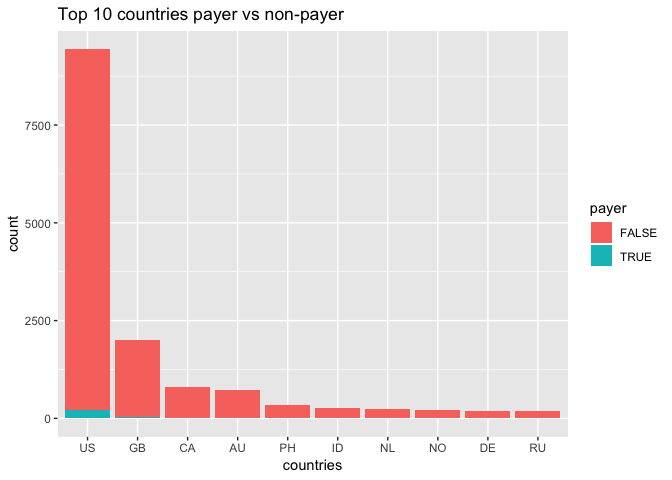
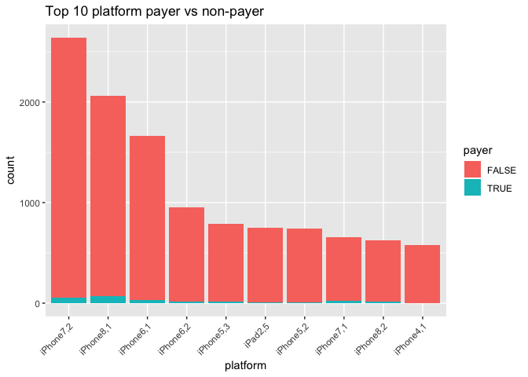
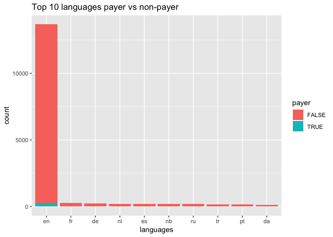
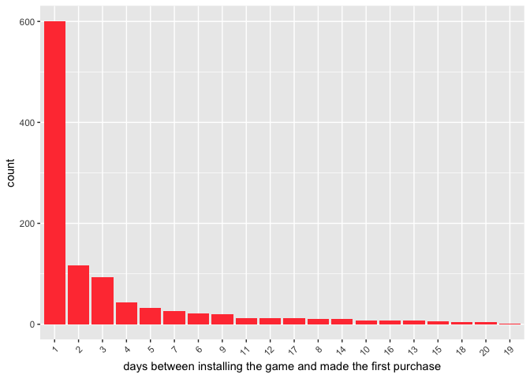

First we define **true non-payer**, **non-payer**, **payer**   
**payer**: players who pays the game and generate real revenues  
**true non-payer**: players who installed the game but never pays    
**non-payer**: players who insalled the game and probably will pay after few weeks    

We are interested in **non-payers**, we suspect they are likely to convert when we give promotion and bring more revenue. After query the `install_date` we found that it ranges from 2016-03-01 to 2016-03-07. And the spending dates range from 2016-03-01 to 2016-04-29. Therefore this data analysis probably would not be suitable in 2019.


### EDA


<!-- -->

52.4% users are from U.S.

<!-- -->


```r
platform = sort(table(all$hw_ver[all$payer==T]), decreasing = T)
platform[1:3]/sum(platform)
```

```
## 
## iPhone8,1 iPhone7,2 iPhone6,1 
## 0.2413793 0.1931034 0.1068966
```


44% of payers use iPhone7 or iPhone8 


```r
lang = sort(table(all$lang), decreasing = T)
lang.names = names(lang)
all = all[all$lang %in% lang.names[1:13],]
all$lang = droplevels(all$lang)

# Stacked
ggplot(all[all$lang %in% lang.names[1:10],], aes(fill=payer,x=reorder(lang,lang,
                     function(x)-length(x)))) + 
    geom_bar(stat = 'count')+
  labs(x = "languages")+
  ggtitle("Top 10 languages payer vs non-payer")
```

<!-- -->

<!-- -->


```r
table(days)[1]/sum(table(days))
```

```
##         1 
## 0.5033501
```

Among all payers 50 % of them made their first purchase on the first day 

### model
In order to distinguish payer from non-payer, we try to fit a binary classifier. I use logistic regression because of its interoperability (logistic regression returns probabilities)  
After EDA we have found some important predictors, so we are going to do some feature engeerings to use them.  


split the dataset into train dataset and test dataset

```r
# set.seed(123)
all$payer = factor(all$payer)
train_ind <- sample(seq_len(nrow(all)), size = nrow(all)*0.8)
train <- all[train_ind, ]
test <- all[-train_ind, ]
table(all$payer)
```

```
## 
## FALSE  TRUE 
## 15523   290
```

```r
table(train$payer)
```

```
## 
## FALSE  TRUE 
## 12423   227
```

```r
table(test$payer)
```

```
## 
## FALSE  TRUE 
##  3100    63
```
Very few payers. This is an unbalanced situation.

we fit `story` `spendtype` `lang` `country` `hw_ver` `days` against `payer`. Hopefully we can distinguish the payer and non-payer.

```r
# formula = formula("payer ~ story + spendtype + lang + country + hw_ver + days")
# x = model.matrix(formula, train)
# 
# # cvfit = cv.glmnet(x, train$payer, family = "binomial",
# #                    type.measure = "class")
# 
# # model = glmnet(x, train$payer, family = "binomial", lambda = cvfit$lambda.min, alpha = 0 )
# 
# test.feature = model.matrix(formula, test)
# 
# y_hat_logistic = as.numeric(predict(cvfit,test.feature , s = "lambda.min", type = "response"))
# 
# fg1 <- y_hat_logistic[test$payer == TRUE]
# bg1 <- y_hat_logistic[test$payer == FALSE]
# 
# roc1 = roc.curve(fg1, bg1, curve = T)
# pr1 = pr.curve(fg1, bg1, curve = T)
# plot(roc1)
# plot(pr1)
```


```r
fit_svm <- svm(payer ~ story + spendtype + lang + country + 
                                   hw_ver + days, data = train)
y_hat = predict(fit_svm, test )
mean(y_hat == test$payer)
```

```
## [1] 0.9996838
```


```r
fit_randomForest = randomForest(payer ~ story + spendtype + lang + country + 
                                   hw_ver + days, 
                   data = train, importance= T,
                   ntree = 100)

y_hat = predict(fit_randomForest, test, type = "response")
mean(y_hat == test$payer)
```

```
## [1] 1
```
A separable case. 

~~We got 98% accuracy on test dataset, which means by using our features we can predict very well. Now we trained a classifier which we can use to predict whether a user would become a payer or not (convert).   
Using this model, we can use it to decide the target group. We just need to put the user info into this model to see how likely this user will convert.  
Remark: to furthur evaluate our model's perfomance, we need more data or we can use A/B testing to test our model's performance.~~
