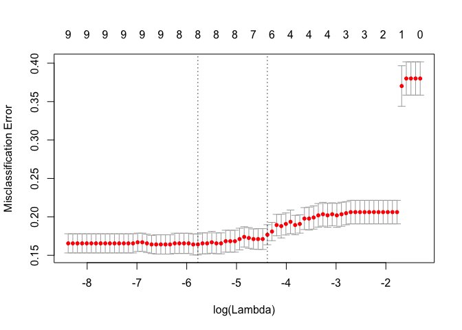
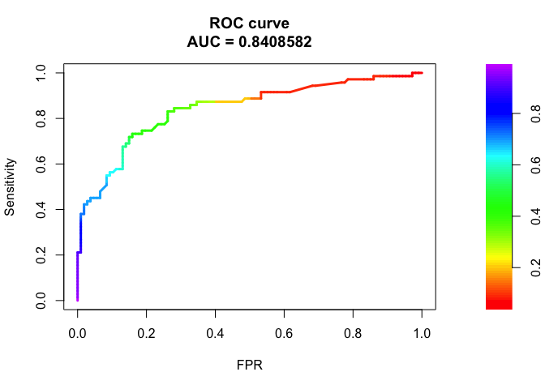
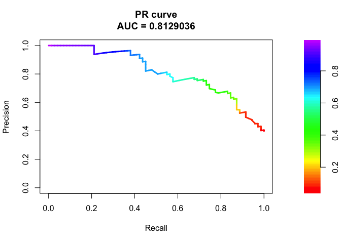

### TODO maybe finish Boosting and Random Forests models on this dataset?


### Problem 1

```r
test = read.csv("test.csv")
train = read.csv("train.csv")
train.label = train$Survived
train.feature = train[,-2]
all = rbind(train.feature, test)
# all$Pclass = as.factor(all$Pclass)
summary(all)
```

```
##   PassengerId       Pclass                                    Name     
##  Min.   :   1   Min.   :1.000   Connolly, Miss. Kate            :   2  
##  1st Qu.: 328   1st Qu.:2.000   Kelly, Mr. James                :   2  
##  Median : 655   Median :3.000   Abbing, Mr. Anthony             :   1  
##  Mean   : 655   Mean   :2.295   Abbott, Mr. Rossmore Edward     :   1  
##  3rd Qu.: 982   3rd Qu.:3.000   Abbott, Mrs. Stanton (Rosa Hunt):   1  
##  Max.   :1309   Max.   :3.000   Abelson, Mr. Samuel             :   1  
##                                 (Other)                         :1301  
##      Sex           Age            SibSp            Parch      
##  female:466   Min.   : 0.17   Min.   :0.0000   Min.   :0.000  
##  male  :843   1st Qu.:21.00   1st Qu.:0.0000   1st Qu.:0.000  
##               Median :28.00   Median :0.0000   Median :0.000  
##               Mean   :29.88   Mean   :0.4989   Mean   :0.385  
##               3rd Qu.:39.00   3rd Qu.:1.0000   3rd Qu.:0.000  
##               Max.   :80.00   Max.   :8.0000   Max.   :9.000  
##               NA's   :263                                     
##       Ticket          Fare                     Cabin      Embarked
##  CA. 2343:  11   Min.   :  0.000                  :1014    :  2   
##  1601    :   8   1st Qu.:  7.896   C23 C25 C27    :   6   C:270   
##  CA 2144 :   8   Median : 14.454   B57 B59 B63 B66:   5   Q:123   
##  3101295 :   7   Mean   : 33.295   G6             :   5   S:914   
##  347077  :   7   3rd Qu.: 31.275   B96 B98        :   4           
##  347082  :   7   Max.   :512.329   C22 C26        :   4           
##  (Other) :1261   NA's   :1         (Other)        : 271
```

From summary we notice that Age has the most missing values, and this is a big deal. Therefore we have to fill in these missing values. Usually we will replace them with the average. In this problem, it can be noticed that people have different age group, and replace the missing value based on different age group might be a good idea. For example, people with the "Miss." title are ususally young, so we replace missing values of these people with the average age of all "Miss".

**feature engineering**


```r
#average age for "Miss."
age1 = mean(all[grep("Miss",all$Name),]$Age,na.rm = TRUE)
#average age for "Mrs."
age2 = mean(all[grep("Mrs",all$Name),]$Age,na.rm=TRUE)
#average age for "Master."
age3 = mean(all[grep("Master",all$Name),]$Age,na.rm = TRUE)
#average age for "Mr."
age4 = mean(all[grep("Mr",all$Name),]$Age,na.rm = TRUE)

all$Age[grep("Miss",all$Name)]= age1
all$Age[grep("Mrs",all$Name)]= age2
all$Age[grep("Master",all$Name)]= age3
all$Age[grep("Mr",all$Name)]= age4
all$Age[grep("Dr",all$Name)] = age4
all$Age[grep("Ms",all$Name)]= age1

summary(all$Age)
```

```
##    Min. 1st Qu.  Median    Mean 3rd Qu.    Max. 
##   5.483  33.322  33.322  29.931  33.322  70.000
```

```r
all$Title = "Other"
all$Title[grep("Miss",all$Name)]="Miss"
all$Title[grep("Mrs",all$Name)]="Mrs"
all$Title[grep("Master",all$Name)]="Master"
all$Title[grep("Mr",all$Name)]= "Mr"
```

No missing values now for Age  
Since there's only one missing value for Fare, we replace it by its average.


```r
#fill missing values of Fare with average
all$Fare[which(is.na(all$Fare))] = mean(all$Fare, na.rm = TRUE)
```

Without missing values, we can now build our model. Before that, it's a good idea to have a validation dataset


```r
#train has 891 rows
#test has 418 rows
set.seed(1)
train.feature = all[1:891,]
train = cbind(train.feature, Survived = train.label)
test = all[892:(892+418-1),]
test$Survived = 0

#we sample 20% of train dataset as validation dataset
index = sample(1:891, 891*0.2)
val = train[index,]
val.feature = val[, -grep("Survived", colnames(val))]
val.label = val$Survived
val.feature = model.matrix( ~ .-1, val.feature)

train = train[-index,]
train.feature = train[, -grep("Survived", colnames(train))]
train.label = train$Survived
train.feature = model.matrix( ~ .-1, train.feature)
```

Here comes a hard part, variable selection.  
You can use LASSO with CV to select  
First of all, we estimates a LASSO model with Alpha = 1. The function cv.glmnet() is used to search for a regularization parameter, namely Lambda, that controls the penalty strength.


```r
#https://www.r-bloggers.com/variable-selection-with-elastic-net/

# registerDoParallel(cores = 4)
# cvfit = cv.glmnet(train.feature, train.label, family = "binomial",
#                   type.measure = "class", paralle = TRUE, alpha = 1)
# plot(cvfit)
# coef(cvfit,s=cvfit$lambda.min)
```

I didn't do it, because you can use your brain(domain knowledge) to select in this problem. For example, clearly Name is not an important feature as it is almost unique to everyone. What we want are general enough features.


```r
formula = formula("Survived ~ Title + Pclass + Sex + Age + Fare + SibSp + Parch")
x = model.matrix(formula, train)

cvfit = cv.glmnet(x, train.label, family = "binomial",
                   type.measure = "class")
plot(cvfit)
```

<!-- -->

```r
val.feature = model.matrix(formula, val)

y_hat_logistic = as.numeric(predict(cvfit,val.feature , s = "lambda.min", type = "response"))

fg1 <- y_hat_logistic[val.label == 1]
bg1 <- y_hat_logistic[val.label == 0]

roc1 = roc.curve(fg1, bg1, curve = T)
pr1 = pr.curve(fg1, bg1, curve = T)
plot(roc1)
```

<!-- -->

```r
plot(pr1)
```

<!-- -->
Now it's time to pick a cutoff value, 0.5 seems a good one.


```r
test.feature = model.matrix(formula, test)

y_hat_logistic = as.numeric(predict(cvfit, test.feature , s = "lambda.min", type = "response"))

sur = rep(0, 418)
for (i in 1:418) {
  if (y_hat_logistic[i] > 0.5){
    sur[i] = 1
  }else{
    sur[i] = 0
  }
}
test$Survived = sur
write.csv(test[c("PassengerId","Survived")],file = "submmision.csv",row.names = FALSE)
```


```r
prop.table(table(train$Survived, train$Sex), 2)
```

```
##    
##        female      male
##   0 0.2459016 0.8144989
##   1 0.7540984 0.1855011
```

```r
test$Survived[test$Sex == "female"] = 1
test$Survived[test$Sex == "male"] = 0

write.csv(test[c("PassengerId","Survived")],file = "baseline.csv",row.names = FALSE)
```

a baseline classifier can achieve 0.76555 accuracy, by setting all women 1 and men 0.


Adding a title feature gives a 0.78468 accuracy. Notice that this is already a very good accuracy. This paper is worth taking a look: [The Ladder: A Reliable Leaderboard for Machine Learning Competitions](https://arxiv.org/abs/1502.04585)
You should also not make the assumption that a model with higher test accuracy is necessarily “better”; if you make many submissions, you are in some sense “overfitting to the test dataset.”


What's more we can do? Of course we can try other models, such as SVM, LDA/QDA, KNN. However, it will not make a big difference. Why? I think it is because the size of this dataset is too small. It's really hard to learn the pattern, even though we use more complicated model, as we will prabably overfit the data. 
The only models I would like to try are models that have low variance such as Random Forests, bagging, and boosting maybe.
[boosting has low variance](https://www.quora.com/What-effect-does-boosting-have-on-bias-and-variance)
